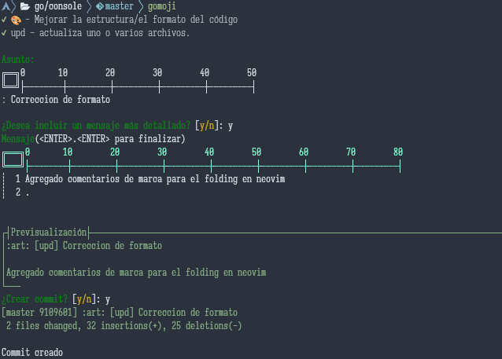

# GOmoji, un cliente commit basado en gitmoji

```
╔═╗╔═╗┌┬┐┌─┐ ┬┬
║ ╦║ ║││││ │ ││
╚═╝╚═╝┴ ┴└─┘└┘┴
```



GOmoji es una pequeña aplicación para colaborar en la creación del commit a traves del estandar [gitmoji](https://gitmoji.dev/) e inspirado en
[gitmoji-cli](https://www.npmjs.com/package/gitmoji-cli). Está desarrollado en Golang y se ejecuta desde la terminal.
